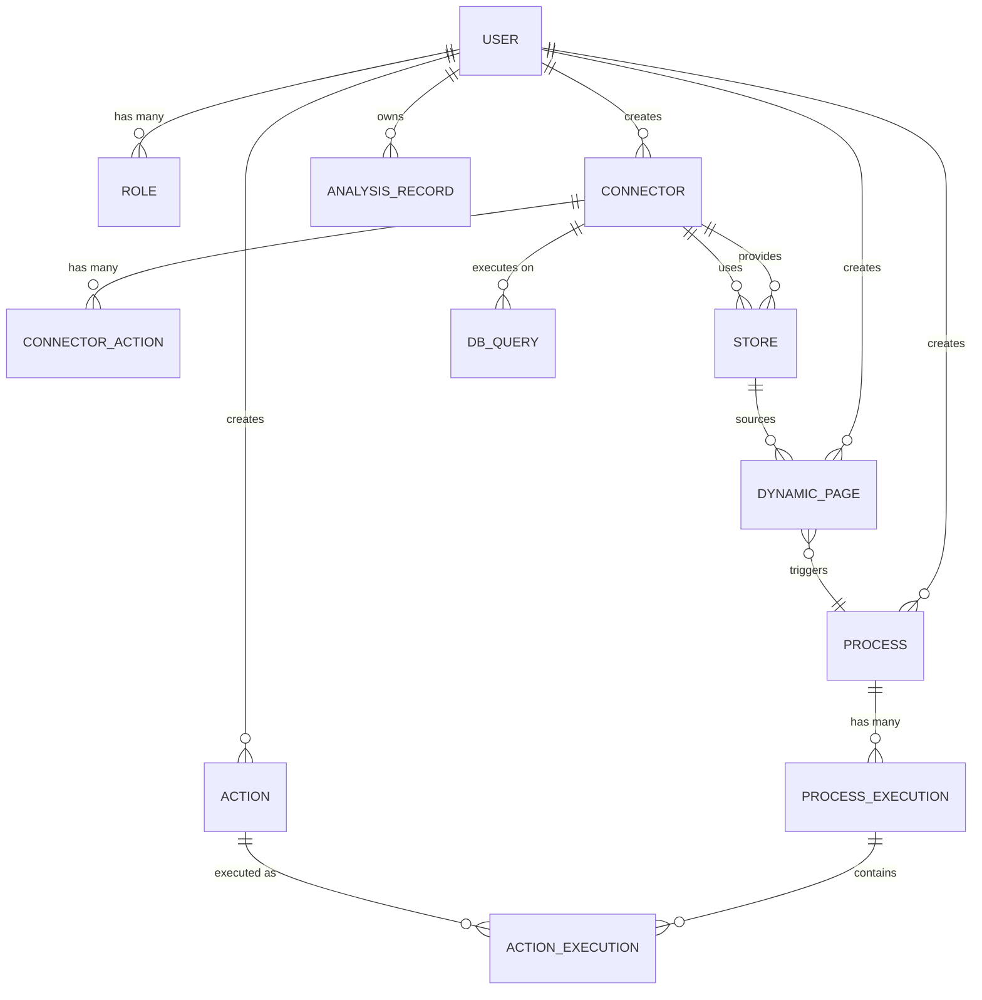
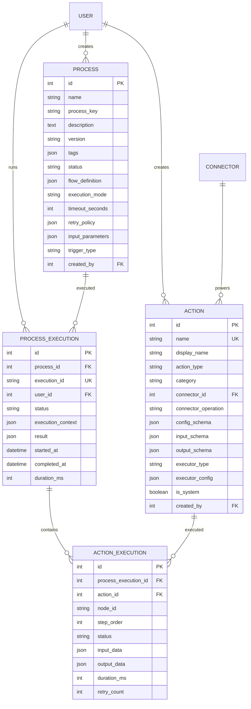

# Data Model Documentation

**Last Updated:** January 23, 2025, 6:45 AM

## Table of Contents
1. [Overview](#overview)
2. [Entity Relationship Diagram](#entity-relationship-diagram)
3. [Core Entities](#core-entities)
4. [Domain Models](#domain-models)
5. [Data Access Patterns](#data-access-patterns)
6. [Index Strategy](#index-strategy)
7. [Data Lifecycle](#data-lifecycle)

---

## Overview

The database schema consists of **35 tables** organized into **8 logical domains**:

| Domain | Tables | Purpose |
|--------|--------|---------|
| **Authentication** | 5 | Users, roles, sessions, permissions |
| **Document Processing** | 7 | File uploads, contract analysis, IDP results |
| **Database Explorer** | 5 | Queries, connections, analysis results |
| **Process Engine** | 5 | Processes, actions, executions |
| **Connector System** | 4 | Connectors, actions, stores |
| **Dynamic Pages** | 1 | Page builder configurations |
| **AI/Prompts** | 4 | System prompts, user prompts |
| **Utilities** | 4 | Menus, settings, notifications, logs |

**Total Schema Size:** 839 lines of Prisma schema  
**Database:** PostgreSQL 14+  
**ORM:** Prisma 6.0.1

---

## Entity Relationship Diagram

### High-Level Domain View



### Authentication Domain

```mermaid
erDiagram
    USER ||--o| USER_PROFILE : has
    USER ||--o{ USER_ROLE : has
    USER ||--o{ SESSION : has
    
    ROLE ||--o{ USER_ROLE : assigned
    ROLE ||--o{ ROLE_PERMISSION : has
    ROLE ||--o{ MENU_PERMISSION : grants
    
    PERMISSION ||--o{ ROLE_PERMISSION : granted
    
    MENU_ITEM ||--o{ MENU_PERMISSION : controls
    MENU_ITEM ||--o{ MENU_ITEM : "parent-child"
    
    USER {
        int id PK
        string email UK
        string password_hash
        string first_name
        string last_name
        boolean is_active
        datetime last_login
    }
    
    USER_PROFILE {
        int id PK
        int user_id FK UK
        text avatar_base64
        string phone
        text bio
    }
    
    ROLE {
        int id PK
        string name UK
        text description
    }
    
    SESSION {
        int id PK
        int user_id FK
        string token IDX
        datetime expires_at
        string ip_address
        text user_agent
    }
```

### Document Processing Domain

```mermaid
erDiagram
    USER ||--o{ UPLOAD : creates
    USER ||--o{ ANALYSIS_RECORD : owns
    
    UPLOAD ||--o{ CONTRACT_ANALYSIS : analyzed
    CONTRACT_ANALYSIS ||--o{ DATA_ANALYSIS : produces
    
    ANALYSIS_RECORD }o--|| UPLOAD : "contract"
    ANALYSIS_RECORD }o--|| UPLOAD : "data"
    ANALYSIS_RECORD }o--|| CONTRACT_ANALYSIS : references
    ANALYSIS_RECORD }o--|| DATA_ANALYSIS : references
    
    UPLOAD {
        int id PK
        int user_id FK
        string job_id IDX
        string filename
        string file_type
        int file_size
        text file_content_base64
        boolean is_public
        json shared_with
    }
    
    CONTRACT_ANALYSIS {
        int id PK
        int upload_id FK
        string job_id IDX
        string execution_id IDX
        string document_name
        string status
        json terms
        json products
        json mulesoft_response
    }
    
    DATA_ANALYSIS {
        int id PK
        int contract_analysis_id FK
        string job_id IDX
        text analysis_markdown
        json data_table
        json mulesoft_response
    }
    
    ANALYSIS_RECORD {
        int id PK
        int user_id FK
        string job_id IDX
        int contract_upload_id FK
        int data_upload_id FK
        int contract_analysis_id FK
        int data_analysis_id FK
        string status
        boolean is_deleted
        json shared_with
    }
```

### Process Engine Domain



### Connector System Domain

```mermaid
erDiagram
    USER ||--o{ CONNECTOR : creates
    CONNECTOR ||--o{ CONNECTOR_ACTION : defines
    CONNECTOR ||--o{ STORE : provides
    CONNECTOR ||--o{ DB_QUERY : executes
    CONNECTOR ||--o{ DB_CONNECTION : manages
    CONNECTOR ||--o{ DB_ANALYSIS_RESULT : analyzes
    CONNECTOR ||--o{ ACTION : powers
    
    CONNECTOR {
        int id PK
        string name
        string connector_type IDX
        string version
        json config "encrypted"
        string auth_type
        json open_api_spec
        string icon_url
        boolean is_active
        boolean is_auto_created
        int created_by FK
        json shared_with
    }
    
    CONNECTOR_ACTION {
        int id PK
        int connector_id FK
        string operation UK
        string operation_id
        string display_name
        string method
        string path
        json parameters
        json request_body
        json responses
    }
    
    STORE {
        int id PK
        int connector_id FK
        string name
        string store_type
        string data_type
        json config
        boolean is_default
        int created_by FK
    }
    
    DB_QUERY {
        int id PK
        int user_id FK
        int connector_id FK
        text query_text
        string query_name
        boolean is_favorite
        int execution_time
        int rows_affected
        string status
        array tags
    }
```

---

## Core Entities

### 1. User (Central Entity)

**Purpose:** Core identity and access management

**Fields:**
```typescript
{
  id: number                // Primary key
  email: string             // Unique, login identifier
  passwordHash: string      // bcrypt hashed
  firstName?: string
  lastName?: string
  defaultMenuItem?: string  // Landing page
  isActive: boolean         // Account enabled/disabled
  lastLogin?: DateTime
  createdAt: DateTime
  updatedAt: DateTime
}
```

**Relationships (23 total):**
- **1:1** → UserProfile (avatar, bio, phone)
- **1:N** → UserRole (role assignments)
- **1:N** → Session (active tokens)
- **1:N** → ActivityLog (all actions)
- **1:N** → Upload (files uploaded)
- **1:N** → AnalysisRecord (document analyses)
- **1:N** → Notification (user notifications)
- **1:N** → ApiLog (API calls made)
- **1:N** → Prompt (custom prompts)
- **1:N** → Flow (visual flows)
- **1:N** → IdpExecution (IDP configs)
- **1:N** → Action (created actions)
- **1:N** → Process (created processes)
- **1:N** → ProcessExecution (process runs)
- **1:N** → Connector (database connections)
- **1:N** → Store (data stores)
- **1:N** → DynamicPage (built pages)
- **1:N** → DbQuery (SQL queries)
- **1:N** → DbConnection (active DB sessions)
- **1:N** → SystemPrompt (created/updated)
- **1:N** → DbAnalysisResult (executed analyses)

**Access Patterns:**
1. Authentication: `findUnique({ where: { email } })`
2. User list: `findMany({ include: { userRoles: { include: { role } } } })`
3. Activity: `findUnique({ where: { id }, include: { activityLogs: { take: 50 } } })`

**Indexes:**
- `email` (unique) - Login lookups
- `isActive` - Filter active users
- `createdAt` - Chronological queries

---

### 2. Connector (Integration Hub)

**Purpose:** Unified access to external systems

**Fields:**
```typescript
{
  id: number
  name: string
  connectorType: string     // 'rest', 'database', 's3', 'ftp', 'redis'
  version: string
  config: Json              // ENCRYPTED credentials
  authType?: string         // 'basic', 'bearer', 'oauth2', 'api_key'
  openApiSpec?: Json        // For REST connectors
  iconUrl?: string
  isActive: boolean
  isAutoCreated: boolean    // Detected from env vars
  category?: string         // 'System', 'User', 'External'
  createdBy: number
  sharedWith: Json          // User IDs with access
  createdAt: DateTime
  updatedAt: DateTime
}
```

**Relationships:**
- **1:N** → ConnectorAction (available operations)
- **1:N** → Action (actions using this connector)
- **1:N** → Store (logical data stores)
- **1:N** → DbQuery (queries executed)
- **1:N** → DbConnection (active connections)
- **1:N** → DbAnalysisResult (analyses performed)
- **N:1** → User (creator)

**Security:**
- Config field encrypted with AES-256-GCM
- Passwords never returned in API responses
- Decryption only when needed (connection time)

**Access Patterns:**
1. User connectors: `findMany({ where: { createdBy: userId } })`
2. Active DB connectors: `findMany({ where: { connectorType: 'database', isActive: true } })`
3. Shared: `findMany({ where: { OR: [{ createdBy }, { sharedWith: { contains: userId } }] } })`

---

### 3. Process (Workflow Definition)

**Purpose:** Visual workflow automation

**Fields:**
```typescript
{
  id: number
  name: string
  processKey?: string       // Technical identifier
  description?: string
  version: string           // e.g., "v1.0"
  tags: Json                // Categorization
  category?: string
  status: string            // 'draft', 'published', 'active', 'deprecated'
  priority: string          // 'high', 'medium', 'low'
  
  // Core Definition
  flowDefinition: Json      // ReactFlow nodes + edges
  executionMode: string     // 'sequential', 'parallel', 'hybrid'
  
  // Execution Settings
  timeoutSeconds?: number
  retryPolicy?: Json
  concurrencyConfig?: Json
  errorHandlingStrategy: string
  
  // Variables
  inputParameters?: Json    // Array of parameter definitions
  environmentVariables?: Json
  globalConstants?: Json
  outputVariables?: Json
  
  // Security
  permissions?: Json
  dataClassification?: string
  complianceTags: Json
  
  // Notifications
  notificationConfig?: Json
  
  // Monitoring
  loggingConfig?: Json
  metricsEnabled: boolean
  performanceSLA?: Json
  
  // Documentation
  documentation?: string    // Markdown
  changelog?: string
  relatedProcesses?: Json
  referenceUrls?: Json
  
  // Deployment
  environment: string       // 'dev', 'staging', 'production'
  deploymentStatus?: string
  
  // Trigger
  isActive: boolean
  isTemplate: boolean
  triggerType: string       // 'manual', 'ui_form', 'api', 'schedule', 'webhook'
  triggerConfig?: Json
  triggerUrl?: string
  
  // Audit
  createdBy: number
  lastModifiedBy?: number
  sharedWith: Json
  createdAt: DateTime
  updatedAt: DateTime
}
```

**Relationships:**
- **1:N** → ProcessExecution (runtime instances)
- **1:N** → DynamicPage (UI pages)
- **N:1** → User (creator, modifier)

**Comprehensive Fields:** This is one of the most feature-rich models, designed for enterprise process management.

---

### 4. Action (Reusable Operation)

**Purpose:** Atomic, reusable operations in workflows

**Fields:**
```typescript
{
  id: number
  name: string              // Unique
  displayName: string
  description?: string
  actionType: string        // 'system', 'user_defined', 'connector'
  category: string          // 'control_flow', 'data', 'api', 'storage', 'idp'
  connectorId?: number      // For connector actions
  connectorOperation?: string
  icon?: string
  iconUrl?: string
  color?: string
  
  // Schemas
  configSchema: Json        // JSON schema for configuration
  inputSchema: Json         // JSON schema for inputs
  outputSchema: Json        // JSON schema for outputs
  
  // Execution
  executorType: string      // 'builtin', 'rest_api', 'script', 'connector'
  executorConfig: Json
  
  // Metadata
  isSystem: boolean
  isActive: boolean
  createdBy: number
  sharedWith: Json
  createdAt: DateTime
  updatedAt: DateTime
}
```

**Relationships:**
- **N:1** → Connector (optional)
- **N:1** → User (creator)
- **1:N** → ActionExecution (runtime executions)

---

## Domain Models

### Authentication Domain

**Tables:** `users`, `user_profiles`, `roles`, `user_roles`, `permissions`, `role_permissions`, `menu_items`, `menu_permissions`, `sessions`

**Purpose:** Complete RBAC system with menu-level control

**Key Patterns:**
- Many-to-many: Users ↔ Roles
- Many-to-many: Roles ↔ Permissions
- Many-to-many: Roles ↔ MenuItems
- Soft delete: Users deactivated, not deleted
- Session expiration: Automatic cleanup via cron

**Permission Levels:**
1. **Role-based:** User → Role → Permissions
2. **Menu-based:** Role → MenuPermission → MenuItem
3. **Resource-based:** `sharedWith` JSON arrays on resources

---

### Document Processing Domain

**Tables:** `uploads`, `contract_analysis`, `data_analysis`, `analysis_records`, `api_logs`, `idp_executions`

**Purpose:** MuleSoft IDP integration for contract analysis

**Workflow:**
```
1. User uploads PDF (contract) + Excel/CSV (data)
   → Insert into `uploads` (base64)
   → Create `analysis_record` (status: pending)

2. Backend sends PDF to MuleSoft IDP
   → Log request in `api_logs`
   → Store result in `contract_analysis`
   → Update `analysis_record` (status: contract_complete)

3. Backend sends data to MuleSoft for analysis
   → Log request in `api_logs`
   → Store result in `data_analysis`
   → Update `analysis_record` (status: complete)

4. User views results
   → Fetch from `analysis_record` + `contract_analysis` + `data_analysis`
```

**Key Patterns:**
- **jobId:** Links all records for a processing run
- **Soft delete:** `is_deleted` flag with audit trail
- **Sharing:** `is_public` + `shared_with` JSON array
- **Full audit:** Every API call logged

---

### Database Explorer Domain

**Tables:** `connectors`, `db_queries`, `db_connections`, `db_analysis_results`, `system_prompts`

**Purpose:** Professional PostgreSQL IDE

**Connection Management:**
```typescript
// Connection pooling (per user + connector)
const cacheKey = `${connectorId}-${userId}`;
if (pools.has(cacheKey)) return pools.get(cacheKey);

// Create new pool
const config = decryptConnectorConfig(connector.config);
const pool = new Pool({ host, port, database, user, password, ... });
pools.set(cacheKey, pool);
```

**Query History:**
- Every query saved to `db_queries`
- Favorite queries marked
- Execution time tracked
- Tags for organization

**AI Optimization:**
- Analysis results in `db_analysis_results`
- System prompts in `system_prompts` (versioned)
- Health scores, recommendations, actions taken

---

### Process Engine Domain

**Tables:** `processes`, `actions`, `process_executions`, `action_executions`, `activity_logs`

**Purpose:** Visual workflow automation

**Execution Model:**
```
1. User triggers process
   → Create `process_execution` (status: pending)
   → Parse `flow_definition` to get action sequence

2. For each action node:
   → Create `action_execution` (status: pending)
   → Fetch action definition from `actions`
   → Execute via executor (builtin, REST, connector, etc.)
   → Store output in `action_execution.output_data`
   → Update status (completed/failed)
   → Log to `activity_logs`

3. On completion/failure:
   → Update `process_execution` (status: completed/failed)
   → Store final result
   → Send notifications
```

**Variable Passing:**
- Output of Action A → Input of Action B
- Stored in `action_execution.output_data`
- Referenced by node ID

---

### Connector System Domain

**Tables:** `connectors`, `connector_actions`, `stores`, `db_connections`

**Purpose:** Unified access layer

**Connector Types:**
| Type | Purpose | Config Fields | Auth Types |
|------|---------|---------------|------------|
| `database` | PostgreSQL, MySQL | host, port, database, user, password | basic |
| `rest` | REST APIs | baseUrl, headers | basic, bearer, oauth2, api_key |
| `s3` | Amazon S3 | bucket, region, accessKey, secretKey | api_key |
| `ftp` | FTP/SFTP | host, port, username, password | basic |
| `redis` | Redis cache | host, port, password | basic |

**Store Abstraction:**
- Logical layer above connectors
- Schema definitions
- Data validation
- Caching strategies
- **Status:** Models defined, limited implementation

---

## Data Access Patterns

### Pattern 1: User Authentication
```typescript
// Login
const user = await prisma.user.findUnique({
  where: { email },
  include: {
    userRoles: {
      include: {
        role: {
          include: {
            rolePermissions: {
              include: { permission: true }
            }
          }
        }
      }
    }
  }
});

// Generate JWT with permissions
const permissions = user.userRoles
  .flatMap(ur => ur.role.rolePermissions)
  .map(rp => rp.permission.name);
```

### Pattern 2: Document Processing
```typescript
// Start processing
const analysisRecord = await prisma.analysisRecord.create({
  data: {
    userId,
    jobId: uuid(),
    contractUploadId: contractFile.id,
    dataUploadId: dataFile.id,
    status: 'pending',
  },
});

// Update with results
await prisma.analysisRecord.update({
  where: { id: analysisRecord.id },
  data: {
    contractAnalysisId: contractAnalysis.id,
    dataAnalysisId: dataAnalysis.id,
    status: 'complete',
  },
});
```

### Pattern 3: Process Execution
```typescript
// Create execution
const execution = await prisma.processExecution.create({
  data: {
    processId,
    executionId: uuid(),
    userId,
    status: 'running',
    executionContext: inputVariables,
    startedAt: new Date(),
  },
});

// Track action execution
await prisma.actionExecution.create({
  data: {
    processExecutionId: execution.id,
    actionId: action.id,
    nodeId: node.id,
    stepOrder: index,
    status: 'running',
    inputData: actionInput,
    startedAt: new Date(),
  },
});
```

### Pattern 4: Activity Logging
```typescript
// Log every action
await prisma.activityLog.create({
  data: {
    userId,
    jobId,
    processId,
    actionId,
    logLevel: 'info',
    actionType: 'process.start',
    actionDescription: `Started process: ${process.name}`,
    ipAddress: getClientIp(req),
    userAgent: getUserAgent(req),
    metadata: { processId, executionId },
    status: 'success',
  },
});
```

---

## Index Strategy

### High-Performance Indexes

**Activity Logs (10 indexes):**
```typescript
@@index([userId])              // Filter by user
@@index([jobId])               // Filter by job
@@index([processId])           // Filter by process
@@index([actionId])            // Filter by action
@@index([actionType])          // Filter by type
@@index([logLevel])            // Filter by level
@@index([createdAt(sort: Desc)]) // Recent first
```

**Rationale:** Activity logs are queried frequently for debugging, auditing, and monitoring.

**Connectors (4 indexes):**
```typescript
@@index([createdBy])           // User's connectors
@@index([connectorType])       // Filter by type
@@index([isActive])            // Active only
@@index([version])             // Version filtering
```

**Processes (6 indexes):**
```typescript
@@index([createdBy])
@@index([lastModifiedBy])
@@index([isActive])
@@index([category])
@@index([triggerType])
@@index([status])
@@index([priority])
@@index([environment])
```

**Sessions (2 indexes):**
```typescript
@@index([token])               // Token lookup (authentication)
@@index([userId])              // User's sessions
```

### Composite Indexes

**DbAnalysisResult:**
```typescript
@@index([schemaName, tableName]) // Table-specific analysis
```

**Unique Constraints:**
```typescript
// Prevent duplicate relationships
@@unique([userId, roleId])      // UserRole
@@unique([roleId, permissionId]) // RolePermission
@@unique([menuItemId, roleId])  // MenuPermission
@@unique([connectorId, operation]) // ConnectorAction

// Ensure data integrity
@@unique([userId])              // UserProfile (1:1)
@@unique([email])               // User (unique login)
```

---

## Data Lifecycle

### User Lifecycle
```
1. Registration
   → Create `user` record
   → Hash password (bcrypt)
   → Assign default role
   → Create empty `user_profile`

2. Active Use
   → Login → Create `session`
   → Actions → Log to `activity_logs`
   → Create resources (processes, connectors, etc.)

3. Deactivation
   → Set `is_active = false`
   → Expire all `sessions`
   → Keep all created resources (don't cascade)

4. Deletion (soft)
   → Set `is_deleted = true` on owned resources
   → Keep user record for audit
   → Anonymize personal data
```

### Process Execution Lifecycle
```
1. Creation
   → `process_executions` (status: pending)
   → `execution_context` stores input variables

2. Running
   → Update status to 'running'
   → Create `action_executions` for each step
   → Log to `activity_logs`
   → Store intermediate outputs

3. Completion
   → Update status to 'completed'/'failed'
   → Store final `result`
   → Calculate `duration_ms`
   → Send notifications

4. Retention
   → Keep executions for audit
   → Archive old executions (>90 days) to cold storage
   → Clean up failed/cancelled executions (>30 days)
```

### Session Lifecycle
```
1. Login
   → Generate JWT token
   → Create `session` record
   → Set `expires_at` (e.g., 24 hours)

2. Active
   → Token validated on each request
   → Check `expires_at`
   → Log user activity

3. Expiration
   → Token expires
   → Session record marked invalid
   → User must login again

4. Cleanup
   → Cron job deletes expired sessions
   → Run daily: DELETE FROM sessions WHERE expires_at < NOW()
```

### File Lifecycle
```
1. Upload
   → Store in `uploads` table (base64)
   → Link to `analysis_record`
   → Set `is_public` / `shared_with`

2. Processing
   → Send to MuleSoft IDP
   → Store results in `contract_analysis` / `data_analysis`
   → Link via `analysis_record`

3. Sharing
   → Update `shared_with` JSON array
   → Or set `is_public = true`

4. Deletion (soft)
   → Set `is_deleted = true` on `analysis_record`
   → Keep `upload` record (don't cascade)
   → Mark `deleted_by` and `deleted_at`

5. Cleanup
   → Hard delete after 90 days
   → Or move to cold storage (S3 Glacier)
```

---

## Data Volume Estimates

### Current Size (Assumed Small-Medium Deployment)

| Table | Estimated Rows | Growth Rate | Cleanup Strategy |
|-------|---------------|-------------|------------------|
| `users` | 10-100 | Slow | None (keep all) |
| `sessions` | 50-500 | Medium | Daily (expired) |
| `activity_logs` | 10K-1M+ | **Fast** | Archive (>90 days) |
| `api_logs` | 5K-500K | **Fast** | Archive (>30 days) |
| `uploads` | 100-10K | Medium | Archive (>90 days, deleted only) |
| `analysis_records` | 100-10K | Medium | Soft delete + archive |
| `db_queries` | 1K-100K | Fast | Keep all (user asset) |
| `process_executions` | 1K-100K | Fast | Archive (>90 days) |
| `action_executions` | 10K-1M+ | **Fast** | Archive with process |
| `connectors` | 10-100 | Slow | None (keep all) |
| `processes` | 50-1K | Slow | None (version control) |
| `actions` | 100-1K | Slow | None (library) |

**High-Growth Tables:** `activity_logs`, `api_logs`, `action_executions`  
**Recommendation:** Implement partitioning and archival strategy

---

## Critical Observations

### Strengths 💪
1. **Comprehensive RBAC** - Multiple permission levels
2. **Full audit trail** - Activity logs + API logs
3. **Flexible metadata** - JSON fields for evolution
4. **Soft deletes** - Maintains audit trail
5. **Good indexing** - Performance-focused

### Weaknesses ⚠️
1. **Base64 file storage** - Not scalable
2. **No partitioning** - Large tables will slow down
3. **No archival strategy** - Logs will grow indefinitely
4. **Incomplete abstractions** - Store layer not implemented
5. **God table** - User has 23 relationships

### Recommendations 🎯
1. **Move files to S3** - Store only URLs in DB
2. **Partition logs** - By month/quarter
3. **Implement archival** - Cold storage for old data
4. **Complete store layer** - Abstract data access
5. **Consider CQRS** - Separate read/write models for heavy tables

---

**Document Status:** ✅ Complete  
**Next:** See `BACKEND_ARCHITECTURE.md` for service layer details

