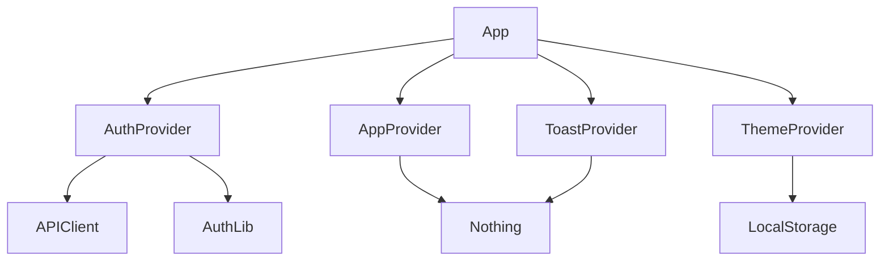
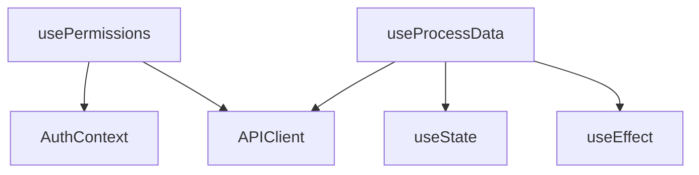

# Dependency Graph Documentation

**Last Updated:** January 23, 2025, 8:30 AM

## Overview

This document maps module dependencies, identifies coupling issues, and visualizes the architecture's dependency structure.

---

## Backend Module Dependencies

### Service Layer Dependencies

```mermaid
graph TD
    AuthService --> PrismaClient
    AuthService --> BcryptLib
    AuthService --> JWTLib
    AuthService --> LoggingService
    
    UserService --> PrismaClient
    UserService --> AuthService
    UserService --> LoggingService
    
    DocumentService --> PrismaClient
    DocumentService --> MuleSoftService
    DocumentService --> LoggingService
    DocumentService --> IDPExecutionService
    
    MuleSoftService --> AxiosLib
    MuleSoftService --> IDPExecutionService
    MuleSoftService --> EncryptionUtil
    MuleSoftService --> LoggingService
    
    DBExplorerService --> PrismaClient
    DBExplorerService --> PGLib
    DBExplorerService --> ConnectorService
    DBExplorerService --> EncryptionUtil
    DBExplorerService --> LoggingService
    
    ConnectorService --> PrismaClient
    ConnectorService --> EncryptionUtil
    ConnectorService --> AutoConnectorService
    ConnectorService --> LoggingService
    
    ProcessService --> PrismaClient
    ProcessService --> LoggingService
    
    ActionService --> PrismaClient
    ActionService --> ConnectorService
    ActionService --> LoggingService
    
    ProcessExecutor --> PrismaClient
    ProcessExecutor --> ActionExecutor
    ProcessExecutor --> ProcessService
    ProcessExecutor --> LoggingService
    
    ActionExecutor --> PrismaClient
    ActionExecutor --> ActionService
    ActionExecutor --> ConnectorExecutor
    ActionExecutor --> BuiltinActions
    
    SystemPromptService --> PrismaClient
    SystemPromptService --> LoggingService
    
    TableAnalysisService --> DBExplorerService
    TableAnalysisService --> PrismaClient
    TableAnalysisService --> LoggingService
    
    AIAnalysisService --> SystemPromptService
    AIAnalysisService --> TableAnalysisService
    AIAnalysisService --> ConnectorService
    AIAnalysisService --> PrismaClient
    AIAnalysisService --> AxiosLib
```



### Controller Layer Dependencies

```mermaid
graph TD
    AuthController --> AuthService
    AuthController --> UserService
    AuthController --> LoggingService
    
    UserController --> UserService
    UserController --> LoggingService
    
    AnalysisController --> DocumentService
    AnalysisController --> LoggingService
    
    ProcessController --> ProcessService
    ProcessController --> ProcessExecutor
    ProcessController --> LoggingService
    
    ActionController --> ActionService
    ActionController --> LoggingService
    
    ConnectorController --> ConnectorService
    ConnectorController --> LoggingService
    
    DBExplorerController --> DBExplorerService
    DBExplorerController --> LoggingService
    
    SystemPromptController --> SystemPromptService
    SystemPromptController --> LoggingService
    
    TableAnalysisController --> TableAnalysisService
    TableAnalysisController --> AIAnalysisService
    TableAnalysisController --> LoggingService
```



### High-Coupling Modules

| Module | Dependencies Count | Dependents Count | Coupling Score |
|--------|-------------------|------------------|----------------|
| **PrismaClient** | 0 | 18 | 🔴 High (god dependency) |
| **LoggingService** | 1 (Prisma) | 15 | 🔴 High (cross-cutting) |
| **DBExplorerService** | 6 | 5 | 🟠 Medium-High |
| **ConnectorService** | 4 | 4 | 🟡 Medium |
| **ProcessExecutor** | 5 | 1 | 🟡 Medium |

---

## Frontend Component Dependencies

### Page Component Dependencies

```mermaid
graph TD
    DatabaseExplorer --> DbTree
    DatabaseExplorer --> QueryEditor
    DatabaseExplorer --> ResultsGrid
    DatabaseExplorer --> ObjectDetailsTabs
    DatabaseExplorer --> ContextMenu
    DatabaseExplorer --> ExportDataDialog
    DatabaseExplorer --> DeleteRowsDialog
    DatabaseExplorer --> SQLFileLoaderDialog
    DatabaseExplorer --> DataImportDialog
    DatabaseExplorer --> APIClient
    
    ProcessDesigner --> ProcessCanvas
    ProcessDesigner --> NodePalette
    ProcessDesigner --> ActionNode
    ProcessDesigner --> ConfigPanel
    ProcessDesigner --> VariablePanel
    ProcessDesigner --> ExecutionPanel
    ProcessDesigner --> ReactFlow
    ProcessDesigner --> APIClient
    
    PageBuilder --> CraftJS
    PageBuilder --> ComponentToolbar
    PageBuilder --> Container
    PageBuilder --> FormInput
    PageBuilder --> DataTable
    PageBuilder --> APIClient
    
    Login --> AuthContext
    Login --> APIClient
    Login --> Button
    Login --> Input
    
    Dashboard --> AuthContext
    Dashboard --> AppContext
    Dashboard --> APIClient
    Dashboard --> Card
    Dashboard --> Chart
```



### Context Provider Dependencies



### Hook Dependencies



---

## Circular Dependencies

### ⚠️ Identified Circular Dependencies

**None found** ✅ (Good!)

**Potential Risk Areas:**
1. **Service ↔ Service:** Some services reference each other
   - `DocumentService` ↔ `MuleSoftService`
   - `ProcessExecutor` ↔ `ActionExecutor`
   
   **Mitigation:** Use dependency injection or interfaces

2. **Context ↔ API:** Auth context used in API, API used in auth
   - **Current:** No actual circular dependency (safe)
   - **Risk:** If API client needs auth context directly

---

## Dependency Metrics

### Backend Services

| Service | Imports | Exported By | Fanout | Fanin |
|---------|---------|-------------|--------|-------|
| PrismaClient | 0 | 18 | 0 | 18 |
| LoggingService | 1 | 15 | 1 | 15 |
| DBExplorerService | 6 | 5 | 6 | 5 |
| ConnectorService | 4 | 4 | 4 | 4 |
| AuthService | 4 | 3 | 4 | 3 |
| UserService | 3 | 2 | 3 | 2 |
| ProcessService | 2 | 3 | 2 | 3 |
| ActionService | 3 | 2 | 3 | 2 |

**Fanout:** Number of modules this module depends on  
**Fanin:** Number of modules that depend on this module

**Ideal:** Low fanout, low fanin (except for utilities)  
**Concern:** High fanin (many dependencies) indicates tight coupling

---

## External Dependencies

### Critical External Dependencies

| Dependency | Used By | Risk Level | Alternative |
|------------|---------|------------|-------------|
| **Prisma** | All services | 🔴 High | TypeORM, Sequelize |
| **Express** | Server | 🔴 High | Fastify, Koa |
| **React** | All frontend | 🔴 High | Vue, Svelte |
| **PostgreSQL** | Database | 🔴 High | MySQL, MongoDB |
| **JWT** | Auth | 🟠 Medium | Session-based |
| **Tailwind** | All components | 🟡 Low | Bootstrap, Material-UI |
| **Monaco Editor** | DB Explorer | 🟡 Low | CodeMirror, Ace |
| **React Flow** | Process Designer | 🟡 Low | Custom canvas |

**Risk Assessment:**
- 🔴 High: Core dependency, system fails without it
- 🟠 Medium: Important, but replaceable with effort
- 🟡 Low: Nice-to-have, easily replaceable

---

## Dependency Inversion Violations

### Issue 1: Direct Database Access in Controllers

**Problem:**
```typescript
// Some controllers call Prisma directly
async getPages(req, res) {
  const pages = await prisma.dynamicPage.findMany(); // ❌
}
```

**Should be:**
```typescript
// Use service layer (dependency inversion)
async getPages(req, res) {
  const pages = await pageService.getPages(req.user.id); // ✅
}
```

---

### Issue 2: Service → Service Direct Calls

**Problem:**
```typescript
// DocumentService directly imports MuleSoftService
import muleSoftService from './mulesoft.service';

class DocumentService {
  async process() {
    await muleSoftService.callAPI(); // Tight coupling
  }
}
```

**Should be:**
```typescript
// Use dependency injection
class DocumentService {
  constructor(private muleSoftService: MuleSoftService) {}
  
  async process() {
    await this.muleSoftService.callAPI();
  }
}

// Or use interface
interface IExternalAPI {
  callAPI(): Promise<void>;
}

class DocumentService {
  constructor(private externalAPI: IExternalAPI) {}
}
```

---

## Dependency Flow

### Request Flow

```
Client Request
  ↓
Express Router
  ↓
Middleware (auth, logging)
  ↓
Controller
  ↓
Service Layer
  ↓
Prisma ORM
  ↓
PostgreSQL
```

**Clean Architecture Layers:**
1. ✅ Presentation (Controllers)
2. ✅ Application (Services)
3. ✅ Domain (Models - Prisma)
4. ✅ Infrastructure (Database, External APIs)

**Violations:**
- ⚠️ Controllers sometimes skip service layer
- ⚠️ Services sometimes call other services directly

---

## Module Cohesion

### High Cohesion (Good) ✅

| Module | Cohesion Type | Reason |
|--------|---------------|--------|
| `AuthService` | Functional | All methods relate to authentication |
| `LoggingService` | Functional | All methods relate to logging |
| `ConnectorService` | Functional | All methods relate to connectors |

### Low Cohesion (Bad) ⚠️

| Module | Cohesion Type | Reason |
|--------|---------------|--------|
| `DBExplorerService` | Coincidental | Too many unrelated responsibilities (1,914 lines) |
| `DocumentService` | Coincidental | Handles upload, processing, MuleSoft, storage |

---

## Recommendations

### Short-Term (1-2 weeks)

1. **Break up `DBExplorerService`**
   - Split into 7 focused services
   - Reduce coupling

2. **Enforce service layer**
   - No direct Prisma calls in controllers
   - Use dependency injection

3. **Add interface abstractions**
   - Define interfaces for services
   - Reduce tight coupling

### Medium-Term (1-2 months)

1. **Implement dependency injection**
   - Use InversifyJS or TypeDI
   - Better testability

2. **Extract cross-cutting concerns**
   - Logging as decorator/aspect
   - Caching as decorator

3. **Create shared kernel**
   - Common types/interfaces
   - Reduce duplication

### Long-Term (3-6 months)

1. **Microservices architecture**
   - Extract DB Explorer as service
   - Extract Process Engine as service
   - Use message queue for communication

2. **Event-driven architecture**
   - Decouple services
   - Use pub/sub

3. **Domain-driven design**
   - Define bounded contexts
   - Aggregate roots
   - Domain events

---

**Document Status:** ✅ Complete  
**Next:** See `CONFIGURATION.md` for environment setup

